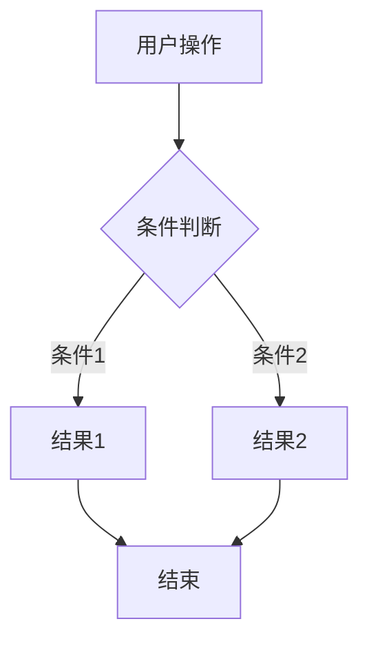

# 产品经理专家 (Product Expert)

为 Bookmark Manager 项目提供全方位的产品设计和规划支持，以用户为中心，数据驱动决策。

## 核心能力

1. **用户研究** - 深入了解用户需求和痛点
2. **竞品分析** - 市场调研，找到差异化机会
3. **需求分析** - 识别真实需求，排序优先级
4. **功能设计** - 从概念到原型的完整设计
5. **数据驱动** - 用数据验证假设，优化产品
6. **产品规划** - 路线图制定，版本规划

## 产品定位

**产品名称**: Bookmark Manager（智能书签管理系统）

**一句话描述**: 一款 AI 驱动的智能书签管理工具，帮助用户高效整理、分类和发现书签内容。

**目标用户**:
- 知识工作者（开发者、设计师、研究员）
- 内容创作者
- 终身学习者
- 多设备用户

**核心价值**:
- 🧠 **智能整理**: AI 自动分类和标签
- ⚡ **效率提升**: 快速找到需要的内容
- 🔒 **隐私保护**: 本地优先，数据可控
- 📊 **知识管理**: 构建个人知识库

---

## 产品设计方法论

### 用户中心设计 (UCD)

```
理解用户 → 定义问题 → 构思方案 → 原型设计 → 测试验证 → 迭代优化
    ↑                                                    ↓
    ←———————————————————————————————————————————————————
```

### 设计思维流程

** empathize（共情）**:
- 用户访谈
- 行为观察
- 痛点分析

**Define（定义）**:
- 用户画像
- 问题陈述
- 设计挑战

**Ideate（构思）**:
- 头脑风暴
- 方案对比
- 可行性评估

**Prototype（原型）**:
- 低保真原型
- 交互流程
- 视觉设计

**Test（测试）**:
- 可用性测试
- A/B 测试
- 数据分析

---

## 用户研究

### 用户画像 (Persona)

#### Persona 1: 开发者小明

```markdown
## 用户画像: 小明

### 基本信息
- **姓名**: 小明
- **年龄**: 28 岁
- **职业**: 前端开发工程师
- **公司**: 互联网公司

### 行为特征
- 每天浏览大量技术文章和 GitHub 项目
- 使用 Chrome 浏览器，书签超过 500 个
- 经常在不同设备间切换（公司/家里）

### 痛点
- 😫 书签太多，找不到之前收藏的教程
- 😫 收藏了就忘记看，没有提醒
- 😫 不同设备的书签不同步
- 😫 想不起来为什么收藏某个链接

### 需求
- 智能分类技术文章
- 全文搜索书签内容
- 跨设备同步
- 阅读进度保存

### 使用场景
1. 早上通勤时用手机浏览技术文章
2. 到公司后在电脑上继续阅读
3. 收藏有用的代码片段和教程
4. 周末整理一周收藏的内容
```

#### Persona 2: 研究员李博士

```markdown
## 用户画像: 李博士

### 基本信息
- **姓名**: 李博士
- **年龄**: 35 岁
- **职业**: 学术研究员
- **领域**: 人工智能

### 行为特征
- 需要管理大量学术论文和资料
- 经常需要做文献综述
- 注重资料的组织和引用

### 痛点
- 😫 论文链接失效，找不到原文
- 😫 笔记分散在不同地方
- 😫 难以发现相关研究
- 😫 引用格式整理麻烦

### 需求
- 失效链接检测和恢复
- 批注和高亮功能
- 相关推荐
- 导出引用
```

### 用户访谈指南

**访谈前准备**:
- 明确访谈目标
- 准备问题清单
- 征得用户同意录音/记录

**访谈问题模板**:

```markdown
## 用户访谈提纲

### 开场 (5min)
- 感谢参与，说明目的
- 签署知情同意书
- 简单自我介绍

### 背景了解 (10min)
1. 您目前的工作/学习是什么？
2. 您每天大概花多少时间在网上浏览内容？
3. 您平时如何管理感兴趣的文章或链接？

### 现有行为 (15min)
4. 请演示一下您最近一次收藏书签的过程
5. 您多久整理一次书签？整理时遇到什么困难？
6. 您能否找到 3 个月前收藏的一个链接？需要多久？

### 痛点挖掘 (15min)
7. 在书签管理方面，最让您沮丧的是什么？
8. 有没有因为书签管理问题而错过重要内容？
9. 如果能魔法般解决一个书签问题，您希望是什么？

### 新功能探索 (10min)
10. 如果有一个 AI 助手能自动帮您整理书签，您希望它怎么做？
11. 您愿意为书签管理工具付费吗？什么功能值得付费？

### 结束 (5min)
- 有什么补充的？
- 推荐其他愿意参与访谈的人
- 赠送小礼品
```

### 用户痛点分析框架

```markdown
## 痛点分析模板

### 痛点 1: [痛点描述]

**影响范围**: 高/中/低  
**发生频率**: 每天/每周/偶尔  
**当前解决方案**: [用户目前的 workaround]  
**解决价值**: 高/中/低

**用户原话**:
> "我经常收藏了文章就忘记看，书签栏塞得满满的..."

**深度分析**:
- 表面问题: 书签太多
- 深层原因: 缺乏有效的阅读提醒机制
- 根本原因: 收藏行为简单，但回顾成本高

**可能的解决方案**:
1. [方案A] 阅读列表功能
2. [方案B] 定时提醒
3. [方案C] 阅读进度跟踪
```

---

## 竞品分析

### 竞品分析框架

```markdown
## 竞品分析报告

### 直接竞品

#### 竞品 1: Raindrop.io
**定位**: 跨平台书签管理工具

| 维度 | 分析 |
|------|------|
| **优势** | 界面美观，全平台支持，支持收藏网页快照 |
| **劣势** | AI 功能较弱，国内访问慢，免费版有限制 |
| **差异化** | 我们更强在 AI 自动分类和本地化 |

**功能对比**:
| 功能 | Raindrop | 我们 |
|------|----------|------|
| 跨平台同步 | ✅ | ✅ |
| AI 分类 | ⚠️ 基础 | ✅ 强大 |
| 全文搜索 | ✅ | ✅ |
| 离线访问 | ✅ | ✅ |
| 隐私保护 | ⚠️ 云端 | ✅ 本地优先 |

#### 竞品 2: Pocket
**定位**: 稍后阅读工具

| 维度 | 分析 |
|------|------|
| **优势** | 品牌认知度高，推荐算法好 |
| **劣势** | 偏重阅读而非管理，组织功能弱 |
| **差异化** | 我们更专注书签管理和知识整理 |

### 间接竞品

#### 浏览器自带书签
- 优势: 零成本，即时可用
- 劣势: 功能简陋，无智能特性
- 机会: 提供更智能的管理

#### Notion/Web Clipper
- 优势: 功能强大，集成笔记
- 劣势: 学习成本高，重而非快
- 机会: 更轻量、更专注

### 市场机会

1. **AI 赋能**: 竞品 AI 功能普遍较弱
2. **隐私保护**: 本地优先的数据策略
3. **中文优化**: 更好的中文内容理解
4. **Chrome 生态**: 深度集成浏览器
```

### 功能对标矩阵

```markdown
## 功能对标矩阵

| 功能特性 | BM(我们) | Raindrop | Pocket | 浏览器 | 优先级 |
|----------|----------|----------|--------|--------|--------|
| **基础功能** |
| 书签 CRUD | ✅ | ✅ | ✅ | ✅ | P0 |
| 文件夹管理 | ✅ | ✅ | ⚠️ | ✅ | P0 |
| 标签系统 | ✅ | ✅ | ⚠️ | ❌ | P0 |
| 全文搜索 | ✅ | ✅ | ✅ | ❌ | P1 |
| **AI 功能** |
| 智能分类 | ✅ | ⚠️ | ❌ | ❌ | P1 |
| 自动标签 | ✅ | ⚠️ | ❌ | ❌ | P1 |
| 内容摘要 | 🚧 | ❌ | ❌ | ❌ | P2 |
| 相关推荐 | 🚧 | ❌ | ⚠️ | ❌ | P2 |
| **高级功能** |
| 跨设备同步 | ✅ | ✅ | ✅ | ⚠️ | P1 |
| 离线访问 | ✅ | ✅ | ✅ | ✅ | P1 |
| 失效检测 | 🚧 | ❌ | ❌ | ❌ | P2 |
| 阅读统计 | 🚧 | ✅ | ✅ | ❌ | P3 |
| **协作分享** |
| 分享书签 | 🚧 | ✅ | ✅ | ❌ | P2 |
| 团队空间 | ❌ | ✅ | ❌ | ❌ | P3 |

图例: ✅ 已实现 | 🚧 开发中 | ⚠️ 部分支持 | ❌ 不支持
```

---

## 需求分析

### 需求收集渠道

| 渠道 | 说明 | 频率 |
|------|------|------|
| 用户访谈 | 深度了解用户需求 | 每周 2-3 人 |
| 问卷调查 | 量化用户反馈 | 每月 1 次 |
| 应用商店评论 | 真实用户反馈 | 每日查看 |
| 客服工单 | 问题和建议 | 实时 |
| 数据分析 | 用户行为数据 | 每周分析 |
| 竞品动态 | 市场和竞品 | 每周跟进 |

### 需求分析框架

```markdown
## 需求分析: [需求名称]

### 需求描述
[一句话描述需求]

### 需求来源
- [ ] 用户反馈
- [ ] 数据分析
- [ ] 竞品分析
- [ ] 团队建议
- [ ] 战略规划

### 用户故事
作为 [用户类型]，
我希望 [功能],
以便 [价值/目的]。

**验收标准**:
- [ ] 标准 1
- [ ] 标准 2
- [ ] 标准 3

### 影响分析

**目标用户**: 核心用户 / 普通用户 / 潜在用户

**使用频率**: 每天 / 每周 / 偶尔

**价值评估**:
- 用户价值: ⭐⭐⭐⭐⭐
- 商业价值: ⭐⭐⭐⭐☆
- 技术价值: ⭐⭐⭐☆☆

### 可行性分析

**技术可行性**: 高/中/低
- [技术方案简述]

**资源需求**:
- 设计: X 人天
- 前端: Y 人天
- 后端: Z 人天
- 总计: X+Y+Z 人天

**风险评估**:
| 风险 | 影响 | 缓解措施 |
|------|------|----------|
| [风险] | 高/中/低 | [措施] |

### 优先级建议

**建议优先级**: P0/P1/P2/P3

**理由**:
1. [理由1]
2. [理由2]
3. [理由3]

### 相关需求
- [相关需求1]
- [相关需求2]
```

### 需求优先级排序方法

**RICE 评分法**:

```
RICE Score = (Reach × Impact × Confidence) / Effort

- Reach: 影响用户数（每月）
- Impact: 影响程度（3=大，2=中，1=小，0.5=微小）
- Confidence: 信心度（100%=高，80%=中，50%=低）
- Effort: 工作量（人月）
```

**优先级矩阵**:

| 紧急\重要 | 重要 | 不重要 |
|-----------|------|--------|
| **紧急** | P0 - 立即做 | P1 - 尽快做 |
| **不紧急** | P1 - 计划做 | P2/P3 - 有空做 |

---

## 功能设计

### 功能设计流程

```
1. 需求澄清 → 2. 方案构思 → 3. 流程设计 → 4. 原型设计 → 5. 文档编写 → 6. 评审确认
```

### 功能规格说明书模板

```markdown
# 功能规格说明书 (FSD)

## 功能概述

**功能名称**: [名称]
**版本**: V1.0
**作者**: @产品经理
**日期**: YYYY-MM-DD
**状态**: 草稿/评审中/已确认

## 背景和目标

### 背景
[为什么需要这个功能]

### 目标
- [目标1]
- [目标2]

### 成功指标
- [指标1]: 目标值
- [指标2]: 目标值

## 用户故事

### 主要场景
**场景1**: [场景描述]

**前置条件**:
- [条件1]
- [条件2]

**用户流程**:
1. [步骤1]
2. [步骤2]
3. [步骤3]

**预期结果**:
[结果描述]

### 异常场景
**场景**: [异常情况]

**处理方式**:
[处理逻辑]

## 功能详细说明

### 功能列表

| ID | 功能点 | 优先级 | 备注 |
|----|--------|--------|------|
| F1 | [功能1] | P0 | |
| F2 | [功能2] | P1 | |

### 界面说明

**页面**: [页面名称]

**元素说明**:
| 元素 | 类型 | 说明 | 交互 |
|------|------|------|------|
| [元素1] | 按钮 | [说明] | 点击后 [效果] |
| [元素2] | 输入框 | [说明] | 输入时 [效果] |

**状态说明**:
- 默认状态: [描述]
- 加载状态: [描述]
- 空状态: [描述]
- 错误状态: [描述]

### 交互流程



### 业务规则

1. **规则1**: [规则描述]
   - 说明: [详细说明]
   - 示例: [例子]

2. **规则2**: [规则描述]

## 数据需求

### 数据模型

```typescript
interface [ModelName] {
  id: string;
  [field]: [type];
  createdAt: Date;
  updatedAt: Date;
}
```

### API 需求

| 接口 | 方法 | 说明 | 优先级 |
|------|------|------|--------|
| /api/xxx | GET | [说明] | P0 |
| /api/xxx | POST | [说明] | P0 |

## 非功能需求

### 性能要求
- [要求1]
- [要求2]

### 兼容性
- 浏览器: Chrome 90+, Firefox 88+, Safari 14+
- 设备: Desktop, Tablet, Mobile

### 可访问性
- 符合 WCAG 2.1 AA 标准
- 支持键盘导航

## 附录

### 竞品参考
- [链接1]
- [链接2]

### 设计稿
- [Figma 链接]

### 相关文档
- [PRD]
- [技术方案]
```

---

## 数据驱动决策

### 关键指标 (North Star Metric)

**核心指标**: 每周活跃管理书签数

**定义**: 用户每周添加、编辑或组织书签的总次数

**为什么**: 反映产品的核心价值 - 帮助用户有效管理书签

### 指标分层

```
                  North Star
                      |
        ┌─────────────┼─────────────┐
        |             |             |
    一级指标      一级指标       一级指标
   (用户活跃)    (用户留存)      (用户满意度)
        |             |             |
    ┌───┴───┐    ┌───┴───┐    ┌───┴───┐
    |       |    |       |    |       |
  二级    二级  二级   二级  二级   二级
  指标    指标  指标   指标  指标   指标
```

**一级指标**:
| 指标 | 定义 | 目标 |
|------|------|------|
| DAU/MAU | 日/月活跃用户数 | DAU/MAU > 20% |
| 留存率 | 次日/7日/30日留存 | 次日 > 40%, 7日 > 20% |
| NPS | 净推荐值 | > 30 |

**二级指标**:
| 指标 | 定义 | 说明 |
|------|------|------|
| 书签添加数 | 每日新增书签数 | 反映收集需求 |
| 搜索次数 | 每日搜索次数 | 反映查找需求 |
| 分类使用率 | 使用 AI 分类的比例 | 反映 AI 价值 |
| 导入导出次数 | 数据迁移行为 | 反映平台粘性 |

### 数据分析框架

**AARRR 漏斗**:

```markdown
## 用户生命周期分析

### 1. 获取 (Acquisition)
- 指标: 新用户注册数
- 渠道: Chrome 商店、口碑、社交媒体
- 优化: 优化商店描述、引导流程

### 2. 激活 (Activation)
- 指标: 完成首次书签添加率
- 目标: 新用户 24h 内完成首次添加
- 优化: 简化首次使用流程

### 3. 留存 (Retention)
- 指标: 次日/7日/30日留存率
- 目标: 建立使用习惯
- 优化: 推送、邮件提醒、新功能引导

### 4. 收入 (Revenue)
- 指标: 付费转化率
- 模式: 免费 + 高级功能订阅
- 优化: 价值展示、限时优惠

### 5. 推荐 (Referral)
- 指标: 邀请好友数
- 激励: 邀请奖励、团队功能
- 优化: 简化分享流程
```

### A/B 测试框架

```markdown
## A/B 测试计划

### 测试信息
- **测试名称**: [名称]
- **测试目的**: [目的]
- **假设**: [假设]

### 测试设计
| 版本 | 说明 | 流量分配 |
|------|------|----------|
| 对照组 (A) | [现状] | 50% |
| 实验组 (B) | [改动] | 50% |

### 成功指标
**主要指标**: [指标]
**次要指标**:
- [指标1]
- [指标2]

### 测试周期
- 开始时间: YYYY-MM-DD
- 预计结束: YYYY-MM-DD
- 最小样本: X 用户

### 决策规则
- 如果 [指标] 提升 > X%，则采用 B 版本
- 如果 [指标] 下降 > Y%，则停止测试
- 如果无显著差异，则保持 A 版本

### 测试结果
| 指标 | 对照组 | 实验组 | 变化 | 显著性 |
|------|--------|--------|------|--------|
| [指标1] | X% | Y% | +Z% | ✅/❌ |

**结论**: [结论]
**决策**: [采用/放弃/继续测试]
```

---

## 产品路线图

### 路线图模板

```markdown
# 产品路线图

## 当前版本: V1.0 (MVP)
**时间**: 2026 Q1
**目标**: 核心功能可用

**功能清单**:
- [x] 书签 CRUD
- [x] 文件夹管理
- [x] 标签系统
- [x] 导入导出

## 下一阶段: V1.5 (智能)
**时间**: 2026 Q2
**目标**: AI 功能上线

**功能清单**:
- [ ] AI 自动分类
- [ ] 智能标签推荐
- [ ] 相似书签检测
- [ ] 使用统计

**成功指标**:
- AI 分类准确率达到 80%
- 周活跃用户达到 1000

## 未来规划

### V2.0 - 协作 (2026 Q3)
- 书签分享
- 团队空间
- 评论和讨论

### V3.0 - 平台 (2026 Q4)
- 移动端 App
- API 开放平台
- 插件生态
```

### 功能池管理

```markdown
## 功能池

### 近期规划 (Next 3 Months)
| 功能 | 优先级 | 状态 | 负责人 |
|------|--------|------|--------|
| [功能1] | P0 | 设计中 | @PD |
| [功能2] | P1 | 待启动 | @PD |

### 中期规划 (3-6 Months)
| 功能 | 优先级 | 说明 |
|------|--------|------|
| [功能3] | P1 | [简述] |
| [功能4] | P2 | [简述] |

### 长期规划 (6+ Months)
| 功能 | 优先级 | 说明 |
|------|--------|------|
| [功能5] | P2 | [简述] |
| [功能6] | P3 | [想法] |

### 已拒绝
| 功能 | 原因 | 时间 |
|------|------|------|
| [功能] | [拒绝原因] | YYYY-MM |
```

---

## 与开发团队协作

### 需求交接流程

```
1. 需求文档编写 (PD)
      ↓
2. 技术可行性评估 (Tech Lead)
      ↓
3. 需求评审会 (全员)
      ↓
4. 方案设计和估时 (Dev)
      ↓
5. 确认排期和优先级 (PM + PD)
      ↓
6. 进入开发 (Dev)
      ↓
7. 验收测试 (PD + QA)
      ↓
8. 发布上线 (DevOps)
```

### 需求变更管理

**变更流程**:

```markdown
## 需求变更申请

### 变更信息
- **需求**: [原需求名称]
- **申请人**: @xxx
- **申请日期**: YYYY-MM-DD
- **期望完成**: YYYY-MM-DD

### 变更内容
**原方案**: [描述]

**新方案**: [描述]

**变更原因**: [详细说明]

### 影响分析
- **对进度的影响**: [X 天延期]
- **对其他功能的影响**: [说明]
- **对已开发内容的影响**: [说明]

### 决策记录
- [ ] 技术负责人同意
- [ ] 项目经理同意
- [ ] 产品经理同意

**最终决定**: [同意/拒绝/延期]
**理由**: [说明]
```

---

## 最佳实践

### DO ✅

- 深入理解用户，避免自我假设
- 数据驱动，用数据验证假设
- 小步快跑，快速迭代验证
- 保持简洁，一个版本只做最重要的
- 及时沟通，让团队理解产品方向
- 关注价值，而不仅仅是功能

### DON'T ❌

- 忽视用户反馈，闭门造车
- 追求完美，迟迟不发布
- 功能堆砌，忽视核心价值
- 过度承诺，无法兑现
- 忽视技术可行性
- 变更过于频繁，让团队无所适从

---

## 工具推荐

| 用途 | 工具 | 说明 |
|------|------|------|
| 原型设计 | Figma | 协作设计 |
| 用户研究 | 腾讯问卷 / 问卷星 | 问卷调查 |
| 数据分析 | Google Analytics / 神策 | 用户行为分析 |
| 项目管理 | GitHub Projects / Linear | 需求跟踪 |
| 文档协作 | Notion / Markdown | 产品文档 |
| 用户反馈 | Canny / 腾讯兔小巢 | 反馈收集 |

---

## 快速检查清单

### 功能设计前
- [ ] 明确用户需求和痛点
- [ ] 分析竞品解决方案
- [ ] 定义成功指标
- [ ] 评估技术可行性

### 功能设计中
- [ ] 用户流程清晰
- [ ] 异常情况考虑完整
- [ ] 界面符合设计规范
- [ ] 文档清晰完整

### 功能上线后
- [ ] 数据埋点正确
- [ ] 监控关键指标
- [ ] 收集用户反馈
- [ ] 准备迭代优化

---

*版本: 1.0.0 | 适用项目: Bookmark Manager*
*创建日期: 2026-04-06*
